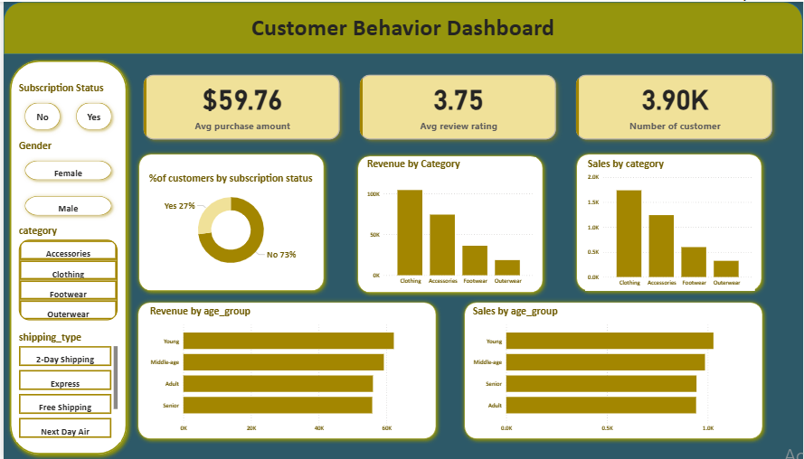
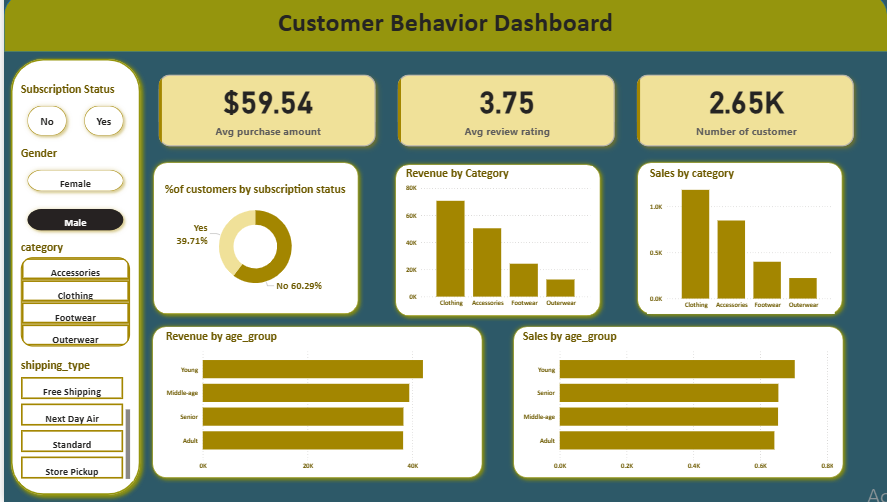
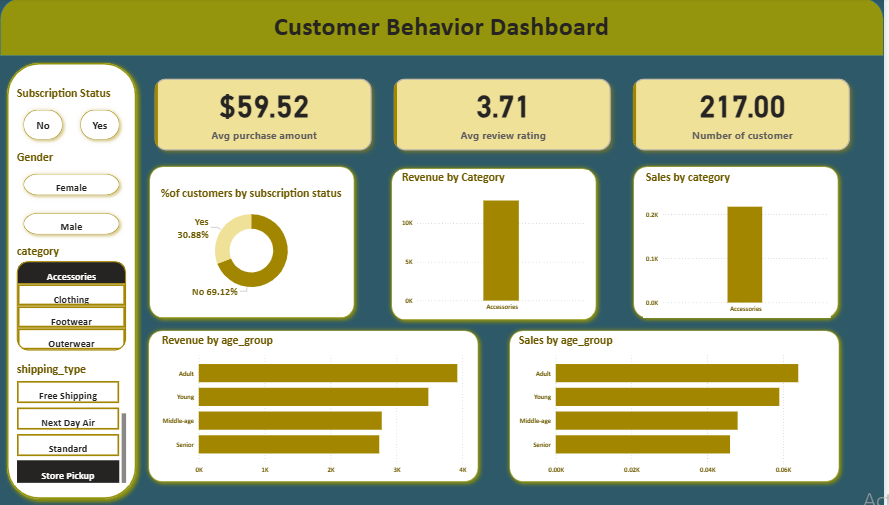

# Customer Shopping Behavior Analysis
An end-to-end Data Analytics project using **Python, MySQL, and Power BI** to analyze customer shopping behavior and uncover business insights.

## Tech Stack
- Python (Pandas)
- MySQL
- Power BI

## Workflow
**CSV Dataset → Python (Cleaning & Feature Engineering) → MySQL (SQL Analysis) → Power BI (Interactive Dashboard)**

## Key Highlights
- Cleaned and transformed customer data
- Performed SQL analysis to answer business questions
- Built an interactive Power BI dashboard
- Visualized customer demographics, sales trends, and purchasing behavior
# Customer Behavior Analysis Dashboard

## 1. Complete Dashboard

---

## 2. Category Slicer

---

## 3. Delivery Type Slicers

---

## 4. Gender Slicer

---

## 5. Subscription Analysis

---

## 6. Category + Delivery Type

## Author

**Hamza Rehman**  
Aspiring Data Analyst
- LinkedIn: www.linkedin.com/in/hamza-rehman-34392b24a
